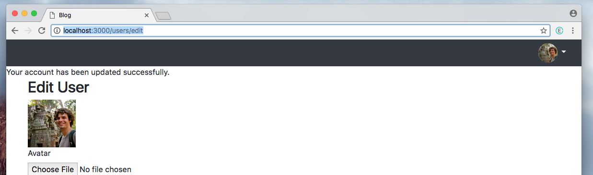
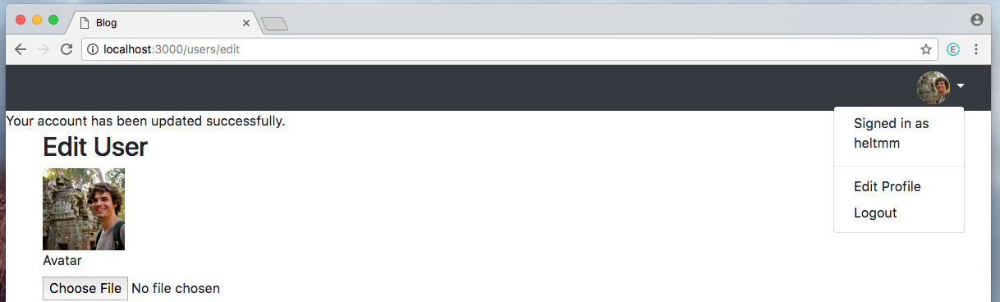

A Journey to Becoming A Rubyist
==============================

Author:
Mark Helt

Description:
------------
You are never done learning especially in the programing field.  As I learn and make new projects I document them in a way I hope others can learn from.  Blog posts and tutorials have been instrumental in my learning and hopefully someone will find these posts helpful to them as well.

About Today:
------------
I decided to work on a blog as there are some topics that I feel like I could write about

* Research Different Rails Blog Tools and tutorials
* Decided on Jekyll as a blog framework because of listed benefits:
  * _static web pages so no need to pull from a slower database_
  * _easily create new posts that follow your chosen template_
  * _easy to host on github as github uses jekyll_
* started off refining my project over the past few days into a nice tutorial
* rebuilt project as wrote tutorial
* screen shots to document different stages
* link to finished tutorial [Dropdown Navbar Template](https://github.com/heltmm/Dropdown-NavBar-Template)

## Screanshots

